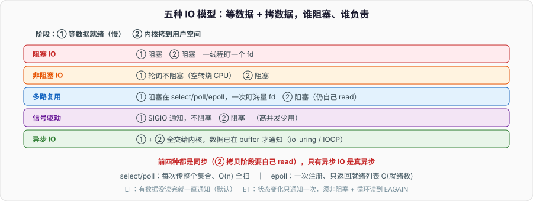

# IO 多路复用与五种 IO 模型：一个线程怎么盯住上万个连接

一个连接一个线程，是最好懂的服务器写法，也是最先撑不住的。连接上万，线程上万，光是上下文切换和栈内存就把机器压垮。高并发服务器（Nginx、Redis、Netty、Node）都不这么干，它们用一个（或少数几个）线程盯住成千上万个连接——靠的就是 IO 多路复用。

面试问 epoll 几乎是必考，但只背「epoll 比 select 快」拿不到分。要讲清的是：IO 到底慢在哪、五种 IO 模型是按什么维度分的、select/poll/epoll 的区别为什么是「O(n) 扫描」变「O(1) 就绪通知」、以及水平触发和边缘触发那个经典的坑。

---

## 一、一次读操作，其实是两个阶段

理解所有 IO 模型的钥匙，是把一次 `read` 拆成两个阶段：

1. **等数据就绪**：数据还没到（网络包在路上、磁盘还没读完），内核的接收缓冲区是空的。
2. **拷数据**：数据到了内核缓冲区，再从内核空间拷到用户空间的 buffer。

「IO 慢」主要慢在第一阶段——等。第二阶段的拷贝是纯 CPU/内存操作，相对快。五种 IO 模型的区别，本质就是**这两个阶段分别是「阻塞等」还是「不阻塞」，以及谁来负责等**。抓住这条主线，五种模型就不是五个孤立名词。

---

## 二、五种 IO 模型：按「谁在等、等哪个阶段」分

**1）阻塞 IO（BIO）。** `read` 一调用，进程就睡在那，直到数据就绪 + 拷贝完成才返回。两个阶段全程阻塞。最好懂，但一个线程只能盯一个 fd，盯 n 个连接要 n 个线程。

**2）非阻塞 IO。** fd 设成非阻塞后，`read` 在数据没就绪时立刻返回 `EAGAIN`,不睡。进程可以轮询（反复问「好了没」）。第一阶段不阻塞，但**轮询空转烧 CPU**,而且拷贝阶段仍阻塞。单纯非阻塞轮询几乎没人用，它是多路复用的基础。

**3）IO 多路复用。** 一个线程用 `select`/`poll`/`epoll` **同时监听一批 fd**,内核告诉你「这批里哪些就绪了」,你再对就绪的那些做 `read`。等待阶段阻塞在「多路复用的系统调用」上（而不是某一个 read），一次能盯住海量 fd。这是本篇主角，也是高并发服务器的地基。

**4）信号驱动 IO。** 注册一个信号处理函数，数据就绪时内核发 `SIGIO` 通知你，你再去 read。理念好但信号在高并发下不好用（信号会合并、难精确对应到 fd），实际很少见。

**5）异步 IO（AIO）。** 前四种在「拷贝阶段」都还得自己阻塞着 read；真正的异步 IO 是：你发起请求就返回，**内核把「等 + 拷贝」两个阶段全做完，数据已经在你 buffer 里了才通知你**。Linux 的 `io_uring`（新）和 POSIX aio（旧、鸡肋）是它。Windows 的 IOCP 是成熟的 AIO。

一句话分类：**前四种都是同步 IO（拷贝阶段要自己 read），只有第五种是真异步（拷贝也交给内核）。** 多路复用虽然能盯很多 fd，但它仍是同步的——就绪后还得自己 read。别把「多路复用」说成「异步 IO」，这是高频错点。

---

## 三、select / poll / epoll：多路复用的三代

三者干同一件事——「盯一批 fd，返回哪些就绪」——但效率天差地别。

**select。** 用一个位图（fd_set）传入要监听的 fd 集合。三个致命限制：

- fd 数量上限 `FD_SETSIZE`（通常 1024），写死在位图大小里。
- 每次调用都要把整个 fd 集合从用户态**拷进内核**;返回后还要**遍历整个集合** O(n) 才知道谁就绪。
- 返回后集合被内核改写，下次调用要重新设置。

**poll。** 用 `pollfd` 数组代替位图，**去掉了 1024 上限**。但「每次拷贝整个集合进内核 + O(n) 遍历找就绪」的根本问题没解决。连接数一大，绝大部分是空闲的，却每次都全量扫一遍。

**epoll。** Linux 的答案，从机制上根治：

- `epoll_create` 在内核建一个事件表（红黑树存所有监听的 fd）。
- `epoll_ctl` **一次性**把 fd 注册进去，不用每次调用重复传。
- `epoll_wait` 只返回**已就绪**的 fd 列表——内核用回调把就绪的 fd 挂到一个就绪链表上，`epoll_wait` 直接取，**不扫描全部**。

关键差别：select/poll 是「你问内核：这 n 个里谁好了？」（内核 O(n) 扫）；epoll 是「就绪的自己报上来」（O(1) 拿就绪列表，与总连接数无关）。10000 个连接里只有 10 个活跃时，epoll 只处理这 10 个，select/poll 要扫 10000 个。这就是 epoll 能扛百万连接（C10K/C10M）的原因。

| 维度 | select | poll | epoll |
| --- | --- | --- | --- |
| fd 上限 | 1024 | 无硬上限 | 无硬上限 |
| 每次调用是否重传 fd 集合 | 是 | 是 | 否（一次注册） |
| 找就绪的复杂度 | O(n) 全扫 | O(n) 全扫 | O(就绪数) |
| 适用 | 少量 fd、跨平台 | 少量/中等 fd | 海量 fd（Linux） |

epoll 不是万能：连接少且几乎都活跃时，select/poll 未必输，epoll 还多了内核数据结构开销。epoll 是 Linux 专有，跨平台库（libevent/libuv）在 BSD/macOS 上用 kqueue、Windows 用 IOCP 兜底。

---

## 四、水平触发 vs 边缘触发：epoll 的经典坑

epoll 有两种触发模式，面试和线上事故都常见：

- **水平触发（LT，默认）**：只要 fd 上**还有数据没读完**,`epoll_wait` 就会**一直**通知你。没读完下次还提醒，安全、好写。
- **边缘触发（ET）**：只在**状态发生变化**（新数据到达那一刻）通知**一次**。这次没把数据读干净，内核不会再提醒，剩下的数据就「卡」在缓冲区里，直到下次又有新数据到来才触发。

ET 的正确用法是：收到通知后，**循环 read 直到返回 `EAGAIN`**（读空为止），且 fd 必须是非阻塞的（否则读空后 read 会阻塞住整个事件循环）。ET 的好处是通知次数少、减少 `epoll_wait` 唤醒，Nginx 用 ET;代价是编程更容易出错——「ET 模式下没读干净导致连接卡死」是经典 bug。

记法：LT 是「有货就喊」，ET 是「到货喊一次」。ET 必须配非阻塞 + 循环读到 EAGAIN。

---

## 五、Reactor：多路复用之上的编程模型

多路复用给的是「哪些 fd 就绪」的原始能力，工程里再包一层 **Reactor 模式**把它变成好用的框架：

- **单 Reactor 单线程**：一个线程跑 `epoll_wait` 事件循环，就绪了就分发处理。Redis 就是这个模型（6.0 前）——单线程、epoll、命令都在内存里跑得快，所以不需要多线程也能扛高 QPS。它慢的地方是「一个大命令阻塞整个循环」，所以 Redis 忌讳 `KEYS *`、大 `value` 操作。
- **单 Reactor 多线程**：事件循环负责 IO，业务处理丢给线程池，避免慢业务卡住循环。
- **主从 Reactor 多线程**：主 Reactor 只管 accept 新连接，从 Reactor（多个，每个一线程 + 一个 epoll）负责已建立连接的读写。Netty、Nginx 是这个模型，把「接连接」和「处理连接」分开，充分吃多核。

事件循环 + 多路复用也是 Node.js、协程调度器（见「进程、线程与协程」）的底层：协程遇到 IO 就把 fd 注册进 epoll、让出执行权，等 epoll 报就绪再唤醒对应协程。所谓「异步非阻塞」，落到系统调用层面几乎都是「epoll + 非阻塞 fd + 事件循环」。

---

## 六、面试收口

- **一次 read 的两个阶段？** 等数据就绪 + 从内核拷到用户空间。IO 慢主要慢在「等」。
- **五种 IO 模型怎么分？** 阻塞、非阻塞、多路复用、信号驱动、异步。前四种都是同步（拷贝阶段自己 read），只有异步 IO 连拷贝都交给内核。
- **多路复用是异步吗？** 不是。它是同步的——就绪后仍要自己 read，只是能一个线程盯很多 fd。
- **select/poll/epoll 的核心区别？** select/poll 每次传整个集合、O(n) 全扫找就绪；epoll 一次注册、只返回就绪列表，O(就绪数)，扛海量连接。
- **LT 和 ET？** LT 有数据没读完就一直通知（默认、好写）；ET 只在状态变化时通知一次，必须非阻塞 + 循环读到 EAGAIN，否则数据卡住。
- **Redis 为什么单线程还快？** 单 Reactor 单线程 + epoll + 纯内存操作；也因此忌讳阻塞整个事件循环的大命令。

这篇是「进程、线程与协程」里事件循环那段的展开，也是 Java NIO、网络编程的操作系统底座。往上接网络专栏的 TCP，往下接协程调度，IO 多路复用是连接「网络」和「操作系统」两块的枢纽。
