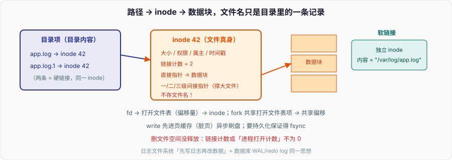

# 文件系统：一个路径名怎么变成磁盘上的块

`open("/var/log/app.log")` 返回一个整数，`read`/`write` 用它读写。但磁盘上没有「文件名」这回事——磁盘只认扇区和块。中间把「人看的路径」翻译成「盘上的块」的那层，就是文件系统。它和虚拟内存是操作系统的两大抽象：一个把物理内存包装成「每个进程独占的地址空间」，一个把裸磁盘包装成「有名字、有目录的文件树」。

面试问文件系统，考点集中在：inode 是什么、文件名到底存在哪、硬链接和软链接的区别、为什么删了文件磁盘空间没释放、以及页缓存怎么让「写文件」先不落盘。

---

## 一、inode：文件的真身，不含文件名

文件系统里，一个文件的**元数据**集中存在一个叫 **inode** 的结构里：文件大小、权限、属主、时间戳、以及**指向数据块的指针**。注意 inode 里**不存文件名**——这是理解一切的关键。每个文件有一个唯一的 inode 号，文件系统内部全靠 inode 号找文件。

那文件名存哪？存在**目录项**里。目录本身也是一种文件，它的内容就是一张表：`(文件名 → inode 号)`。所以「路径解析」是一层层查目录：查 `/` 的目录项找到 `var` 的 inode，读 `var` 目录找到 `log` 的 inode，再找到 `app.log` 的 inode——**文件名是目录里的一条记录，不是文件的属性**。

这个「名字和实体分离」的设计直接解释了两个现象：

- **同一个文件可以有多个名字**（多条目录项指向同一 inode）——就是硬链接。
- **改文件名/移动文件**（同一文件系统内）不动数据，只改目录项，所以极快、和文件多大无关。

inode 里指向数据块的指针用**多级索引**：前几个是直接指针（指向数据块），后面是一级、二级、三级间接指针（指针指向「装满指针的块」）。小文件几个直接指针就够，大文件靠间接指针撑起 TB 级容量。inode 本身数量在格式化时就定了，**inode 用完了即使磁盘还有空间也创建不了新文件**——海量小文件的机器 `df -i` 爆了、`df -h` 还剩很多，就是这个。

---

## 二、硬链接 vs 软链接：同一个真身，还是一个指路牌

- **硬链接**：新建一条目录项，指向**同一个 inode**。两个名字完全平等，没有「谁是原始」之分。inode 里有个**链接计数**,建一个硬链接 +1。`rm` 删的是目录项 + 计数 -1;**计数减到 0，数据块才真正释放**。所以「删了文件磁盘没释放」的常见原因之一，是还有别的硬链接（或还有进程打开着它，见下）。硬链接不能跨文件系统（inode 号只在本文件系统内唯一），也不能给目录建（防成环）。
- **软链接（符号链接）**：是一个**独立的文件**，有自己的 inode，内容就是**目标的路径字符串**。访问时内核看到是软链接，就按里面的路径再解析一次。软链接可以跨文件系统、可以指向目录;但**目标被删了，软链接就悬空**（指向不存在的路径），成了「死链接」。

一句话：硬链接是「同一个人的另一个名字」,软链接是「写着某人地址的纸条」。

还有个更隐蔽的「删不掉空间」场景：**进程打开着文件时 `rm` 它**。目录项没了、`ls` 看不到，但只要那个进程还持有 fd，inode 链接计数虽为 0 但**打开计数不为 0**,数据块不释放。这就是「删了日志文件，`df` 空间不降，重启进程才降」的原因——生产事故常见。正确做法是 `truncate` 或让进程重开文件（logrotate 的 copytruncate / 信号重开就是干这个）。

---

## 三、从 open 到磁盘：几张表串起来

进程侧和内核侧靠三张表连起来，这也是「fd 是什么」的完整答案：

1. **进程的文件描述符表**：每个进程一张，`fd`（那个整数）是这张表的下标，指向系统级的打开文件表项。0/1/2 就是 stdin/stdout/stderr。
2. **系统级打开文件表**：每个 `open` 一项，存**读写偏移量**、打开模式（O_RDONLY 等）、以及指向 inode 的引用。
3. **inode 表（内存里的 inode 缓存）**：指向真正的文件元数据和数据块。

由此能解释几个经典问题：

- **`fork` 后父子进程共享文件偏移量**：子进程复制的是 fd 表，但两个 fd 指向**同一个打开文件表项**,偏移量共享。所以父子交替写同一个 fd 不会互相覆盖（各自 write 推进同一个 offset）。
- **`dup` / 重定向**：让两个 fd 指向同一个打开文件表项，共享偏移。
- **两个进程各自 `open` 同一文件**：各有独立的打开文件表项、**独立偏移**,但指向同一个 inode。

`open` 时内核做路径解析（逐级查目录 inode）、权限检查，在打开文件表登记，返回最小可用 fd。这条链是「进程、fd、文件、磁盘」四者关系的骨架。

---

## 四、页缓存：写文件为什么「立刻就返回」

`write` 返回成功，数据**不一定落盘了**。内核有 **页缓存（page cache）**:读文件先查缓存，命中就不碰磁盘;写文件先写进页缓存、标记为「脏页」,就返回——真正落盘由内核后台异步刷（`pdflush`/`writeback`），或达到阈值、或 `fsync` 时才落。

这带来性能，也带来风险：**`write` 返回 ≠ 数据安全**。机器断电，还在页缓存里没刷盘的脏页就丢了。所以数据库、消息队列这类要持久化保证的系统，关键路径会显式 `fsync`（或 `fdatasync`）强制刷盘并等待完成——这也是它们「写入慢」的一大来源，是可靠性和性能的直接权衡（对应到 MySQL 的 redo log 刷盘策略 `innodb_flush_log_at_trx_commit`）。

页缓存和虚拟内存是同一套物理页的两种用途：文件页（page cache）可以直接丢弃再从磁盘读回，匿名页（堆栈）没有后备文件只能换到 swap（见「虚拟内存」）。内存紧张时内核优先回收干净的文件页。`free` 里那一大坨 `buff/cache` 就是它，不是「内存被吃了」,是可回收的缓存。

`mmap` 是页缓存的另一个入口：把文件映射进地址空间，读写内存即读写文件，省掉 `read`/`write` 的一次用户/内核拷贝。多个进程 `mmap` 同一文件共享页缓存的物理页。

---

## 五、崩溃一致性：日志文件系统在防什么

「写文件」往往不是一次写：更新数据块、更新 inode、更新空闲块位图、更新目录项……如果写到一半断电，文件系统会处于**不一致**状态（比如 inode 说文件占了这些块，位图却标它们空闲，将来被分给别人 → 数据损坏）。

老式文件系统靠开机 `fsck` 全盘扫描修复，盘一大要扫很久。现代文件系统（ext4、XFS、NTFS）用**日志（journaling）**:改动先按「事务」写进一块日志区，标记提交，再真正落到最终位置。崩溃后重启，只需重放（或回滚）日志里未完成的事务，不用全盘扫描。这和数据库的 WAL（redo log）是**同一个思想**——先写日志再改数据，用日志把「一组操作」变成原子的、可恢复的。理解了文件系统日志，MySQL 的 redo log 就是同一套逻辑换了层。

ext4 默认 `ordered` 模式：只对元数据记日志，数据块保证在元数据提交前落盘。全数据日志（`journal` 模式）更安全但更慢（数据写两遍）。这又是可靠性 vs 性能的权衡。

---

## 六、面试收口

- **inode 是什么？存文件名吗？** inode 存文件元数据 + 数据块指针，**不存文件名**;文件名存在目录项里（名字→inode 号的映射）。
- **硬链接和软链接？** 硬链接是指向同一 inode 的另一目录项，平等、计数管生死、不跨文件系统;软链接是存目标路径的独立文件，可跨盘、可悬空。
- **删了文件为什么空间没释放？** inode 链接计数或打开计数不为 0——还有硬链接，或有进程打开着它;后者要 truncate 或重开文件。
- **write 返回就安全了吗？** 没有。数据先进页缓存（脏页），异步刷盘;要持久化保证得 `fsync`。
- **日志文件系统防什么？** 防写到一半崩溃导致的不一致。先写日志再改数据，崩溃后重放日志，和数据库 WAL/redo log 同一思想。
- **fork 后父子写同一 fd 会乱吗？** 不会。共享同一打开文件表项、共享偏移量，各自 write 顺序推进。

文件系统和虚拟内存共用页缓存、和 IO 多路复用共用 fd 抽象、和数据库共享 WAL 思想——它是把「磁盘」这块硬件抽象成「文件树」的那层，也是理解 Linux「一切皆文件」的根。
