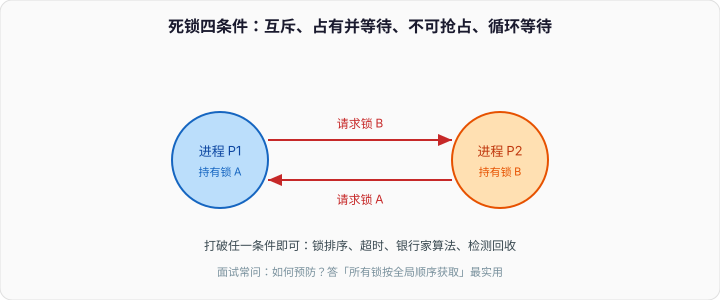

# 死锁：锁顺序比锁本身更容易写错

两个线程，两把锁。A 先拿 `mu1` 再拿 `mu2`，B 先拿 `mu2` 再拿 `mu1`。一旦交错成「各拿一把、再要对方那把」，两边都停。这不是内核 bug，是你自己的等待环。

连环问第 11 题有定义和四个条件，进程篇也提过霍尔德条件。本篇用能编译的例子把环画出来，说清预防、避免、检测各自在工程里实际怎么用——以及哪些「像死锁」其实不是死锁。



---

## 一、四个条件缺一不可

教科书叫 Coffman 条件：

1. **互斥。** 这把锁同时只能一个人持有。`std::mutex`、文件锁、行锁都满足。
2. **占有并等待。** 已经拿着东西，还要再要一份，要不到就阻塞，手里的不放。
3. **不可抢占。** 别人不能把你手里的锁夺走，只能等你自己 `unlock`。
4. **循环等待。** 等待图上有环。

拆掉任意一条，环就长不出来。工程上最常拆的是第 4 条：全局锁顺序。拆第 2 条是「要第二把锁失败就把第一把也放掉」。拆第 3 条在用户态互斥量上几乎不做，操作系统不会去抢你的 `std::mutex`。拆第 1 条意味着不用互斥，那是无锁结构，另一套复杂度。

死锁和活锁、饥饿不是一类：

- **死锁：** 环上的人永远等。CPU 可能很闲。
- **活锁：** 大家都在动（重试、后退），但协议上谁也前进不了。CPU 可能很忙。
- **饥饿：** 没有环，但调度或锁策略让某个线程一直拿不到。

用 `top` 看：死锁的线程是 sleep；活锁是 running。

优先级反转也常被拿来一起问：低优先级持锁，中优先级占着 CPU，高优先级在等锁。这不是环，是调度把持锁的人饿住了。解决是优先级继承：持锁期间临时抬到等待者的优先级。实时内核和部分 RT mutex 在做，普通 `std::mutex` 没有。

---

## 二、最小复现

```cpp
#include <chrono>
#include <mutex>
#include <thread>

std::mutex a, b;

void ab() {
    std::lock_guard<std::mutex> ga(a);
    std::this_thread::sleep_for(std::chrono::milliseconds(1)); // 放大交错窗口
    std::lock_guard<std::mutex> gb(b);
}

void ba() {
    std::lock_guard<std::mutex> gb(b);
    std::this_thread::sleep_for(std::chrono::milliseconds(1));
    std::lock_guard<std::mutex> ga(a);
}

int main() {
    std::thread t1(ab), t2(ba);
    t1.join();
    t2.join();
}
```

不是每次都会死。睡眠是为了让「各拿一把」更容易出现。线上没有睡眠，高并发一样能撞上，只是难复现。

C++ 标准库给了拆环的工具：`std::lock(a, b)` 用避免死锁的算法同时锁两把（内部可能 try + 回退）。`std::scoped_lock` 同样。自己写 `lock_guard` 嵌套，就要保证全程序同一顺序。

按地址排序是一种全局序号：

```cpp
void lock_both(std::mutex& x, std::mutex& y) {
    if (&x < &y) {
        std::lock_guard<std::mutex> gx(x);
        std::lock_guard<std::mutex> gy(y);
        // ...
    } else {
        std::lock_guard<std::mutex> gy(y);
        std::lock_guard<std::mutex> gx(x);
        // ...
    }
}
```

对象被销毁再分配，地址可能复用，这种序号只适合活着的锁。业务上更好的是显式层次：先账户锁、再订单锁，写进注释和 code review 清单。

数据库行锁是同一问题：事务 T1 改行 x 再改 y，T2 改 y 再改 x。InnoDB 会检测环并回滚其中一个，返回 deadlock。那是 **检测 + 牺牲**，不是预防。应用侧仍应把 SQL 涉及的行按主键顺序更新，少制造环。

哲学家就餐是同一模型的教具：五个人五把叉，每人先拿左再拿右，就能成环。改成「最后一个人反着拿」或「同时拿两把（try + 回退）」都能拆。不要在面试里只画叉子不说对应到互斥量。

---

## 三、预防、避免、检测：各自的代价

**预防（工程默认）。**

- 锁排序：所有锁有全局序号，始终从小到大拿。对象地址、表名、文件描述符都可以当序号。
- 锁层次：规定「先会话锁、再缓冲锁」，不许反过来。文档化，code review 盯。
- 一把大锁：没有第二把，长不出环。代价是并发度。有些启动路径宁可这样。
- 持锁区间短、不在锁里做 IO、不调未知回调：环的窗口越小，越难撞上。这不是拆条件，是减概率。

**避免（银行家）。** 要预先知道每个进程的最大需求，每次分配都检查「还存在一条安全序列」。数据库连接、线程池里几乎没人这么干，需求说不清，检查本身要全局视图。操作系统教科书必考，生产代码里当趣闻。

**检测。** 维护等待图，定期找环，挑一个牺牲者回滚。InnoDB、部分消息中间件在用。应用进程里自己做等待图，成本通常高于「把锁顺序写对」。超时（`try_lock_for`）是检测的穷版本：不等图，只等时间，误伤活着但慢的临界区。

Go 的 `sync.Mutex` 没有超时。死锁时进程还在跑，只是那几条 goroutine 停了。`fatal error: all goroutines are asleep - deadlock` 是运行时发现 **所有** goroutine 都堵上了，局部死锁检测不到。C++ 没有这层福利。

分布式里的「死锁」常常是另一件事：两个服务互相 RPC 同步等待，线程池耗尽。等待图跨进程，InnoDB 那套检测帮不上。超时、异步、避免 A 调 B 的同时 B 调 A，是同一条锁顺序在网络上的投影。

---

## 四、容易误判的现场

- **忘记解锁：** 不是环，是有人把锁带走了。RAII（`lock_guard`）就是为了堵这条。异常、早退、`goto` 在手动 `unlock` 下都是炸弹。
- **回调里再加锁：** 锁的顺序被调用方打乱。持锁时不要调用户回调，或规定回调不得再拿同一把锁。
- **条件变量用错：** `wait` 会放锁，看起来像「没占有」。配错谓词或忘了 `notify`，像死锁，其实是丢唤醒。
- **join 自己：** 线程等自己结束。环的长度为 1。
- **线程池任务同步等待池内另一个任务：** 池耗尽时，两个任务互相等对方被调度，表现像死锁。本质是资源数不够，和第 2 条「占有并等待」同类。修复是：别在池内任务里再 `get()` 同池的 future，或把依赖拆到池外。
- **读写锁升级：** 持有 shared 再要 unique，自己和自己以及其他 shared 互等。读写锁不要升级，先放再独占，或一开始就独占。

内核死锁（驱动、文件系统）和用户态锁是两层。`hung_task`、NMI watchdog 看到的是内核线程。用户态要用 `gdb`、`pstack`、Go 的 `SIGQUIT` 看 goroutine 栈。

---

## 五、怎么查

Linux 上线程卡在 `futex_wait`，基本就是互斥量。`gdb -p <pid>` 然后 `thread apply all bt`，看谁拿着哪把锁、谁在等。Helgrind、ThreadSanitizer 能抓数据竞争，对锁顺序帮助有限。自己在锁上打序号断言（debug 下检查「当前持有的最大序号 < 将要拿的」）比事后查栈便宜。

```text
# 典型现场
Thread 1: lock A     →  futex_wait on B
Thread 2: lock B     →  futex_wait on A
```

两份栈对上看，环就出来了。只有一份栈在 `futex_wait`、另一份在跑业务，更像是持锁的人慢，还没死。

MySQL `SHOW ENGINE INNODB STATUS` 的 `LATEST DETECTED DEADLOCK` 把两个事务的 SQL 和持有的行锁打出来。应用日志要留事务 ID，才能对上。被牺牲的事务收到 `1213 Deadlock found`，要重试整笔，不是重试这一条语句——否则另一半变更已经回滚，只重试尾句会把数据打穿。

---

## 六、收口

死锁是等待图有环。四个条件是分析工具，不是四件要分别配置的开关。日常写代码：锁排序 + RAII + 持锁区间短 + 不在锁里调未知回调。超时和检测是补网，不是第一选择。

和虚拟内存的关系：死锁的线程不缺页，它们在等锁；缺页会阻塞，但内核会跑别人，构不成「所有人互相等锁」那种环。和 IPC 的关系：进程间用文件锁、futex 跨进程，环可以跨进程，查起来更烦，顺序规则仍然适用。

连环问第 11 题是本篇的定义版。这里多的是能跑的反例、InnoDB 的检测，以及一堆不是死锁的现场。
