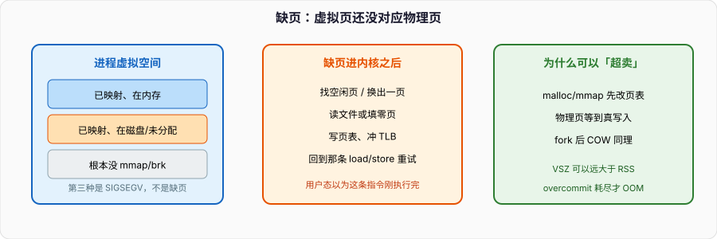

# 虚拟内存：每个进程都以为自己独占地址空间

`malloc` 返回的指针、函数里的局部变量、`mmap` 出来的文件窗口，在进程看来都是「这块内存」。物理上它们可能还没对应任何 DRAM 页，也可能和别的进程共享同一页，也可能在磁盘上。中间这层叫虚拟内存。

专栏里进程那篇已经画过页表和 COW。连环问里也有「快表和多级页表」「虚拟内存怎么实现」的短答。本篇把地址怎么切、缺页之后内核干什么、为什么 VSZ 可以远大于 RSS 写清楚。页表硬件细节仍以那张四级页表图为准，不重复画位域。



---

## 一、为什么要这层翻译

物理内存是一份、线性的、所有人抢的。若进程直接拿物理地址，会有三件事做不成：

1. **隔离。** A 的指针不能碰到 B 的栈。没有翻译，就只能靠「大家都自觉」，这在通用 OS 里不成立。
2. **连续错觉。** 堆要一块看起来连续的 2GB，物理上可能拼不出连续 2GB。虚拟空间可以连续，物理页东一块西一块。
3. **超卖。** 程序 `malloc` 了 1GB 但只写了 8MB，不该立刻占 1GB DRAM。虚拟页可以先在页表里占坑，物理页等到缺页再给。

MMU 按页（常见 4KB）做翻译。虚拟地址切开：高位进页表，低 12 位是页内偏移，偏移不用翻译。x86-64 用户态常见 48 位有效地址，四级页表每级 9 位，最后 12 位偏移。硬件走一遍页表（或命中 TLB）得到物理页号，拼上偏移，才是真正的总线地址。

页表是 **每个地址空间一份**。线程共享同一份；`fork` 复制页表（COW 先共享物理页）；`exec` 丢掉旧表换新的。进程切换要换 CR3（或同等寄存器），TLB 里属于旧地址空间的项失效——除非用 PCID 这类标签避免全刷。这就是「切进程比切同进程线程更贵」的硬件原因之一。

页表项上还有权限位：用户/内核、读/写、可执行。W^X（可写和可执行不同时开）让栈上的注入代码跑不起来。NX 位、ASLR（随机化 mmap/堆/栈基址）都是这张表上的策略，不是另起一套地址。

---

## 二、缺页不是崩溃

页表项可以是「无效」。CPU 访存走到无效项，产生缺页异常，陷入内核。内核看的是 **这个地址在 VMA 里合法吗**：

- **合法但还没分配物理页：** 匿名映射（堆、栈、`mmap` 匿名）补一张零页或换入；文件映射把对应文件页读进来。填页表，冲 TLB，从那条指令重试。用户态不知道自己被打断过。
- **合法但当前无权：** 例如 COW 页标成只读，写入时缺页，内核拷一页给写的那方，改成可写。这不是错误。
- **根本没有 VMA：** 野指针、栈溢出越过守卫页。内核送 SIGSEGV。这才是崩溃。

所以「缺页」和「段错误」不是同义词。`malloc` 之后第一次写，几乎必缺页，这是设计。

Linux 把进程的虚拟范围记成一串 **VMA**（`vm_area_struct`）：`[start, end)`、权限、是文件还是匿名、是私有还是共享。`/proc/pid/maps` 每一行就是一个 VMA。`mmap` / `brk` / 栈扩展，改的是这张表。MMU 页表是这张表的硬件投影，可以比 VMA 更懒：VMA 在，页表项可以还是空的。

Linux 默认 overcommit：`malloc` 成功只保证虚拟地址，不保证物理页。RSS 是真正占着的物理页；VSZ 是虚拟地址跨度。机器内存不够时，下一次缺页可能触发 OOM killer，选一个进程杀掉。面试把 `malloc` 成功理解成「内存已经到手」，和事实不符。

`vm.overcommit_memory=2` 改成严格记账，`malloc` 可能直接失败。数据库、交易系统有时会这么配，避免运行到一半被 OOM。默认的启发式（值为 0）适合普通服务器。

---

## 三、TLB、多级页表、巨页

页表在内存里。每次访存若都走四级，等于 4 次额外读。TLB 是 MMU 边上的小缓存：虚拟页号 → 物理页号。命中则翻译结束。容量很小，工作集一散，miss 就上去。

多级页表的好处是 **稀疏**：64 位空间绝大多数从未映射，中间层可以缺省，不必为整份地址空间准备一张扁平大表。代价是 miss 时内存访问次数变多。内核用大页（2MB / 1GB）减少层数和 TLB 压力，数据库、虚拟机常用；进程内普通 `malloc` 仍是 4KB。

透明巨页（THP）会在运行时把连续 4KB 合成 2MB。对一些负载是加速，对延迟敏感的服务可能引入突然的压缩/拆页卡顿。MySQL、Redis 生产环境经常关 THP，不是玄学，是延迟毛刺。

换出：物理页不够时，匿名页进 swap，文件页可以直接丢（文件还在磁盘上）。换出之后页表项改成「不在内存」，下次访问再缺页换入。抖动（thrashing）是工作集比物理内存大，整天换进换出，CPU 都在等磁盘。`vm.swappiness` 只是「有多愿意用 swap」的倾向，不是开关。

页面置换课堂上讲 OPT / FIFO / LRU。内核实际更接近 CLOCK / LRU 近似：页上有访问位，扫描时清位，没被重新置位的先换。OPT 需要未来信息，只做上限对比。面试答「Linux 用 LRU」即可，再往下能说到 CLOCK 和活跃/非活跃链表就够。

---

## 四、和 C++ / Go 对得上的几件事

- C++ `new` 底层是分配器向 OS 要页（`brk`/`mmap`），再切成对象。对象析构不把页还内核，分配器自己留着。`malloc_trim`、进程退出才会还。所以「delete 了 RSS 没掉」经常是正常的。
- 栈是一块预先保留的虚拟范围，守卫页在低地址。写穿守卫页 → SIGSEGV，不是「再缺一页自动长」。主线程栈由内核按 `ulimit -s` 留；线程栈 pthread 自己 `mmap`。
- Go 的栈能增长，是运行时自己拷到更大的虚拟范围，不是内核把同一段 VMA 拉长那么简单。
- `mmap` 文件是把文件偏移和虚拟页绑在一起。多个进程 `MAP_SHARED` 同一文件，物理页共享，写对彼此可见。`MAP_PRIVATE` 是 COW，写入自己的副本。
- `mlock` 可以要求页留在物理内存，避免被换出，交易系统和实时路径会用。权限不够或锁太多会失败。

RSS、PSS、USS 三个数：

- RSS：这个进程页表里「在内存」的页 × 页大小，共享库会被每个进程各算一次。
- PSS：共享页按进程数平分再加私有页。看「这进程真正该负责多少 DRAM」用它。
- USS：只有自己才映射的页。杀这个进程能立刻腾出来的，就是它。

`top` 默认的 MEM% 按 RSS。VSZ 吓人通常只是映射了很大一块文件或预留了堆，不代表占着那么多 DRAM。

---

## 五、排障

```bash
# VSZ / RSS
ps -o pid,vsz,rss,comm -p $$
# 看 VMA
cat /proc/$$/maps
# 缺页计数：minflt 不进磁盘，majflt 进磁盘
ps -o minflt,majflt -p $$
# 共享/私有拆开
smem -p          # 若装了
cat /proc/$$/smaps_rollup
```

RSS 涨、majflt 涨，才是在换页。只有 minflt 是「第一次摸到匿名页」，正常。启动瞬间 minflt 很高，不说明泄漏。

泄漏看的是 RSS 或 PSS 随时间单调涨，且业务量没变。VSZ 涨、RSS 不涨，更像是一直 `mmap` 不碰，或分配器向 OS 要了还没交回去。

OOM killer 的日志在 `dmesg`：`Killed process ...` 带 `oom_score_adj`。分数高的先杀。数据库、中间件通常把 `oom_score_adj` 调低，避免先被干掉。这和死锁无关：被 OOM 的进程是牺牲品，不是互等。

---

## 六、面试收口

- 「虚拟地址和物理地址谁大？」虚拟是每个进程一份错觉，位数可以大于物理。物理是机器上真正的条。
- 「缺页一定慢吗？」匿名零页、COW 断页是内存操作；majflt 才读盘。
- 「为什么切进程要刷 TLB？」页表换了，旧翻译是别人的。PCID 可以给 TLB 项打地址空间标签，减少全刷。
- 「malloc 成功了内存就在吗？」默认 overcommit 下，只保证虚拟地址。物理页到缺页再给，不够就 OOM。
- 和死锁、调度的关系：缺页时进程阻塞在内核，调度器会跑别人。缺页过多表现为 IO wait，不是死锁。

连环问第 34 题是本篇的短答版。进程那篇的四级页表图和 COW 图是硬件侧，本篇是「缺页之后内核干什么」。
